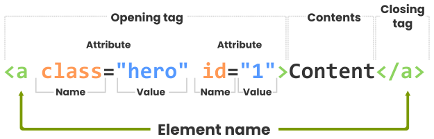

# HTML

HTML (HyperText Markup Language) is the standard markup language used to structure content on the web.

## Table of Contents

* [What is HTML?](#what-is-html)
* [HTML = HyperText Markup Language](#html--hypertext-markup-language)

  * [Hypertext](#hypertext)
  * [Markup](#markup)
  * [Language](#language)
* [HTML's Best Friends: CSS and JavaScript](#htmls-best-friends-css-and-javascript)
* [The DOCTYPE Declaration](#the-doctype-declaration)
* [Specifying Character Encoding Standard](#specifying-character-encoding-standard)
* [Elements and Tags](#elements-and-tags)

  * [HTML Elements](#html-elements)
  * [HTML Tags](#html-tags)
  * [Elements vs. Tags](#elements-vs-tags)
* [Block-Level and Inline Elements](#block-level-and-inline-elements)

  * [Block-Level Elements](#block-level-elements)
  * [Inline Elements](#inline-elements)
* [HTML Comments](#html-comments)
* [Attributes and Values](#attributes-and-values)

  * [Global vs. Element-Specific Attributes](#global-vs-element-specific-attributes)
* [The HTML Tag](#the-html-tag)
* [The Head Section](#the-head-section)
* [The Body Section](#the-body-section)
* [Understanding the Interaction Between HTML, CSS, and JavaScript](#understanding-the-interaction-between-html-css-and-javascript)
* [The Document Object Model (DOM)](#the-document-object-model-dom)

  * [DOM Tree Example](#dom-tree-example)
* [License](#license)

---

# What is HTML?

HTML is like **the skeleton of a website**, giving it structure and form. It sets up everything you see online, from text and images to forms and buttons.

Without HTML, websites would just be plain text without any organization.

## HTML = HyperText Markup Language

### Hypertext

**Hypertext** refers to **text that contains links to other documents or resources**.

In HTML, hypertext allows users to navigate between different web pages by clicking on links.

### Markup

**Markup** refers to the **annotations or tags** that are used to define the structure and formatting of content in a document.

In HTML, markup tags are used to specify elements such as headings, paragraphs, images, and links that make a web page visually appealing and easy to navigate.

These tags provide information to web browsers about how the content should be structured, styled, and rendered on the user's screen.

### Language

**Language** refers to the **system of rules and syntax used to write and interpret the markup** in a consistent and standardized manner.

HTML provides a set of predefined tags and attributes that define how content should be displayed and interacted with in a web browser.

It's the universal translator, the language that humans, computers, and browsers understand.

---

# HTML's Best Friends: CSS and JavaScript

With HTML, you have the power to **organize and structure your content** in a way that makes sense.

It's like creating a blueprint for your web page, where you can define headings, paragraphs, images, links, and so much more.

Think of it as your **elementary tool** for crafting engaging and interactive online experiences.

HTML is not alone in this adventure. It teams up with its partners:

* **CSS (Cascading Style Sheets)** — controls the presentation and appearance of the webpage.
* **JavaScript** — adds behavior and interactivity to the webpage.

Think of CSS as the **paint and decorations** that make a room look good, giving websites their style and flair.

JavaScript is like the **gadgets in a room**, adding fun and interactive features that make the website more interesting and useful.

A simple way to remember their roles:

```text
HTML        → Structure
CSS         → Presentation
JavaScript  → Behavior
```

---

# The DOCTYPE Declaration

The DOCTYPE declaration is an integral part of HTML syntax and an important element in an HTML document that helps web browsers understand how to interpret the document's content.

In simple terms, the DOCTYPE declaration tells the web browser which version of HTML is being used in the document.

This is important because different versions of HTML have different rules and features. By including the DOCTYPE declaration, you are ensuring that the web browser knows which set of rules to follow when it displays the web page.

The DOCTYPE declaration is **a special line of code** that should appear **at the very beginning of an HTML document**, before any other content or elements.

The DOCTYPE declaration for HTML5 is:

```html
<!DOCTYPE html>
```

This **tells the web browser that the document is written in HTML5**, and the browser will therefore expect to see HTML5 syntax and features throughout the rest of the document.

---

# Specifying Character Encoding Standard

UTF-8 is the most commonly used character encoding standard for web development today.

It is the **default encoding standard used by HTML5**, and is recommended for use in all modern web applications.

To specify the character encoding standard as UTF-8 in an HTML document, you can use the following code in the `<head>` section:

```html
<meta charset="UTF-8">
```

This tells the web browser that the document is encoded using UTF-8, and the browser can use the appropriate decoding algorithm to render the characters correctly.

It's crucial to use the correct character encoding standard for your web pages to ensure that all characters are displayed accurately.

UTF-8 is a recommended choice for most modern web applications because it can handle a wide range of characters and is widely supported by browsers and other web tools.

---

# Elements and Tags

HTML is made up of a series of **elements**, which are defined by **tags**.

The terms "elements" and "tags" are closely related but have distinct meanings.

## HTML Elements

An HTML element is a part of a webpage, like a paragraph of text, an image, or a form.

It's the basic unit of content and structure within an HTML document.

Elements tell the web browser how to display the content.

## HTML Tags

Tags are the markers that define the start and end of an element.

They are written with angle brackets, like:

```html
<tag>
```

for the start of an element and:

```html
</tag>
```

for the end.

Tags label the type of content they enclose, instructing the browser on how to process it.

For instance, a paragraph is created with a `<p>` tag, indicating the start, and a `</p>` tag, marking the end, with the actual text content in between.


## Understanding Tags and Elements

An HTML element encompasses everything from the start tag to the end tag, including the content and the tags themselves.

The basic structure of an HTML element includes:

* The opening tag: `<tag>`
* The content itself
* The closing tag: `</tag>`

In essence, the opening tag marks the start of an element and **can include attributes**, which are extra details that configure or adjust the element's behavior.

Attributes have a name and a value, separated by an equals sign, with the value enclosed in quotes.

The content of the element is what's displayed or used, such as text or an image link.

The closing tag indicates the end of the element.



Some elements, like the image element (``), **don't contain content** and therefore **don't have a closing tag**.

These are commonly referred to as **void elements**.

For example:

```html

```

## Elements vs. Tags

In summary:

| Concept     | Meaning                                                                                   |
| ----------- | ----------------------------------------------------------------------------------------- |
| **Element** | The whole structure, including the opening tag, content, and closing tag when applicable. |
| **Tag**     | The opening and closing markers that define an element.                                   |

An **element refers to the whole structure**, including the opening tag, the content, and the closing tag (if present).

A **tag refers specifically to the opening and closing markers** that define the start and end of an element.

Tags are not displayed on the webpage. Instead, they instruct the browser on how to interpret the content.

HTML offers a variety of tags to organize and display content on the web.

The number of tags can vary with different versions of HTML. HTML5 provides a large collection of standard elements, and developers can also create custom elements.

As HTML evolves, the list of available elements changes, introducing new features and occasionally deprecating older ones.

Staying updated with HTML standards is important for creating compatible and efficient web pages.

---

# Block-Level and Inline Elements

In traditional HTML terminology, elements have commonly been described as either:

* **block-level elements**
* **inline elements**

> **Note:** Modern HTML specifications focus more on the semantics of elements and CSS display behavior. The block/inline distinction is still useful when learning how elements are laid out on a page.

## Block-Level Elements

Block-level elements are used to **create the main structure of a web page**, such as headings, paragraphs, and lists.

They traditionally start on a new line and take up the available width of their container.

This means that content placed inside a block-level element creates a separate block of content from the content before or after it.

Examples include:

* `<h1>` through `<h6>` for headings
* `<p>` for paragraphs
* `<ul>` and `<ol>` for lists
* `<div>` for grouping content

Example:

```html
<h1>This is a heading</h1>

<p>This is a paragraph.</p>

<div>
    This is a division.
</div>
```

## Inline Elements

Inline elements are used within the flow of surrounding content.

They traditionally do not start on a new line and only take up as much space as their content requires.

Multiple inline elements can therefore appear on the same line.

Examples include:

* `<a>` for links
* `` for images
* `<span>` for styling or grouping inline content

Example:

```html
<p>
    Visit our
    <a href="https://example.com">website</a>
    for more information.
</p>
```

---

# HTML Comments

HTML comments are a way to **add notes or remarks in an HTML document** that won't be visible to the user.

Comments can be used to:

* Explain what certain parts of the code do.
* Document your HTML.
* Temporarily disable parts of the code during development.

To create a comment, enclose the text you want to comment out between `<!--` and `-->`.

For example:

```html
<!-- This is a comment. -->
```

Comments are ignored by the browser when rendering the visible webpage.

---

# Attributes and Values

Attributes provide additional information about an element, such as its style, source, or behavior.

They are included within the opening tag and consist of a **name-value pair**.

You can add attributes to an HTML element by using the attribute name, followed by an equal sign and the attribute value.

For example:

```html
attribute="value"
```

The value can be enclosed in:

* Double quotes
* Single quotes
* In some cases, left unquoted when allowed by HTML syntax

For example, the `` element can use several attributes to specify information about the image.

The most commonly used attributes are:

* `src` — specifies the path or URL of the image.
* `alt` — provides alternative text describing the image.

Example:

```html

```

The `alt` attribute is especially important for accessibility and provides text that can be used when the image cannot be displayed.

Attributes are a key feature in HTML and can be used with almost all HTML elements.

They allow developers to **customize the behavior and appearance of HTML elements** with greater precision and flexibility.

They can be used to specify information such as:

* Links
* Form behavior
* Multimedia sources
* Identification
* Styling hooks
* Additional information

Attributes are therefore a fundamental aspect of building web pages and applications.

---

# Global vs. Element-Specific Attributes

HTML attributes can be broadly classified into two categories:

## Global Attributes

**Global attributes** can be applied to any HTML element, subject to the rules of the specific attribute.

They are useful for a wide range of purposes, such as assigning unique identifiers, adding classes for styling, or providing additional information about an element.

Examples include:

```html
id
class
style
title
```

Example:

```html
<p id="intro" class="important" title="Introduction">
    Welcome to my website.
</p>
```

## Element-Specific Attributes

**Element-specific attributes** are associated with particular HTML elements and provide functionality specific to those elements.

Examples include:

* `href` — commonly used with `<a>` elements.
* `src` — commonly used with ``, `<script>`, and media elements.
* `type` — used by elements such as `<input>`, `<button>`, and `<script>` for different purposes.

Example:

```html
<a href="https://example.com">Visit Example</a>


<input type="email">
```

---

# The HTML Tag

The HTML tag (`<html>`) is one of the most important elements in an HTML document.

It **defines the root of the HTML document** and contains the document's `<head>` and `<body>` sections.

Everything in the document appears between the opening `<html>` tag and the closing `</html>` tag.

Example:

```html
<!DOCTYPE html>

<html>
    <!-- The head section goes here. -->

    <!-- The body section goes here. -->
</html>
```

The `<html>` element can also have attributes. For example, the `lang` attribute can specify the language of the document:

```html
<html lang="en">
```

A complete basic HTML document can therefore begin with:

```html
<!DOCTYPE html>
<html lang="en">

</html>
```

---

# The Head Section

The `<head>` section is an important component of an HTML document that contains **information used by the browser to display and interact with the web page**.

It can also provide **additional context for search engines and other tools**.

The `<head>` section is not displayed as visible page content. It contains information that operates behind the scenes.

Some of the key pieces of information that can be included in the `<head>` section are:

## Page Title

The `<title>` element defines the title of the web page.

It can appear in the browser tab and is also used by search engines when displaying information about a page.

Example:

```html
<title>My Web Page</title>
```

## Metadata

Metadata provides information about the HTML document.

For example:

```html
<meta name="author" content="Peter Jackson">
```

Other metadata can provide descriptions and other information about the document.

## Links to External Files

The `<head>` can contain links to external resources such as CSS stylesheets.

Example:

```html
<link rel="stylesheet" href="styles.css">
```

JavaScript files can also be included:

```html
<script src="script.js"></script>
```

## Character Encoding

The character encoding tells the browser which character encoding to use when interpreting the document.

Example:

```html
<meta charset="UTF-8">
```

A typical `<head>` section might look like:

```html
<head>
    <title>My Web Page</title>

    <meta charset="UTF-8">
    <meta name="description" content="A description of my web page">

    <link rel="stylesheet" href="styles.css">

    <script src="script.js"></script>
</head>
```

---

# The Body Section

The `<body>` section is the part of an HTML document that contains **the visible content of the web page**.

This includes:

* Text
* Images
* Videos
* Forms
* Links
* Lists
* Tables
* And much more

While the `<head>` section contains metadata and other information that is not normally visible on the web page, the `<body>` section contains **the actual content that the user sees and interacts with**.

The two sections work together:

```text
HTML Document
│
├── <head>
│   ├── Metadata
│   ├── Page title
│   ├── CSS
│   ├── JavaScript
│   └── Character encoding
│
└── <body>
    ├── Headings
    ├── Paragraphs
    ├── Images
    ├── Videos
    ├── Forms
    ├── Links
    ├── Lists
    └── Tables
```

## Examples of Body Content

### Text

You can use headings, paragraphs, and other text elements to present content to the user.

```html
<h1>My Website</h1>

<p>Welcome to my website.</p>
```

### Images

You can include photos, icons, and logos.

```html

```

### Videos

You can add video content such as tutorials and product demonstrations.

```html
<video controls>
    <source src="video.mp4" type="video/mp4">
</video>
```

### Forms

Forms allow users to submit information.

```html
<form>
    <input type="text" name="username">
    <button type="submit">Submit</button>
</form>
```

### Links

Links allow users to navigate to other pages or resources.

```html
<a href="https://example.com">Visit Example</a>
```

### Lists

Lists can organize related pieces of information.

Unordered list:

```html
<ul>
    <li>HTML</li>
    <li>CSS</li>
    <li>JavaScript</li>
</ul>
```

Ordered list:

```html
<ol>
    <li>Open the browser.</li>
    <li>Enter the URL.</li>
    <li>Visit the website.</li>
</ol>
```

### Tables

Tables can be used to present structured data.

```html
<table>
    <tr>
        <th>Name</th>
        <th>Age</th>
    </tr>
    <tr>
        <td>John</td>
        <td>25</td>
    </tr>
</table>
```

And many more…

## Complete Example

Here's a simple example of a complete HTML document:

```html
<!DOCTYPE html>
<html lang="en">
    <head>
        <title>John Smith Photography</title>

        <meta charset="UTF-8">
        <meta
            name="description"
            content="John Smith Photography specializes in capturing authentic and compelling images that tell the story of your business, project, or cause."
        >

        <link rel="stylesheet" href="styles.css">
        <script src="script.js"></script>
    </head>

    <body>
        <h1>Bringing Your Brand to Life with Striking Visuals</h1>

        <p>
            Lorem ipsum dolor sit amet, consectetur adipiscing elit,
            sed do eiusmod tempor incididunt ut labore et dolore magna aliqua.
        </p>

        
    </body>
</html>
```

---

# Understanding the Interaction Between HTML, CSS, and JavaScript

HTML, CSS, and JavaScript are the three primary technologies commonly used together in web development to create dynamic and engaging web pages.

Each technology has its own role:

| Technology     | Role                                                                    |
| -------------- | ----------------------------------------------------------------------- |
| **HTML**       | Provides the basic structure and content of the web page.               |
| **CSS**        | Defines the presentation, layout, colors, fonts, and visual appearance. |
| **JavaScript** | Adds interactivity and behavior to the web page.                        |

A useful way to think about them is:

```text
              Web Page
                 │
       ┌─────────┼─────────┐
       │         │         │
      HTML      CSS    JavaScript
       │         │         │
   Structure  Style     Behavior
```

### HTML

HTML defines **what the content is** and how it is structured.

```html
<h1>Hello World</h1>
<p>Welcome to my website.</p>
```

### CSS

CSS controls **how the content looks**.

```css
h1 {
    font-size: 40px;
}

p {
    font-size: 18px;
}
```

### JavaScript

JavaScript controls **how the page behaves and responds to interactions**.

```javascript
document.querySelector("h1").textContent = "Hello JavaScript!";
```

Together, these technologies allow developers to build structured, visually appealing, and interactive web pages.

---

# The Document Object Model (DOM)

The **Document Object Model (DOM)** is a programming interface that represents an HTML document as a structured tree of objects.

It allows web developers to **change the content and structure of an HTML document using JavaScript code**.

When a web page is loaded in a browser, the DOM is created as **a memory representation** of the web page's content and structure.

Developers can then use JavaScript to manipulate the DOM, which lets them:

* Add elements
* Remove elements
* Change elements
* Change text
* Change attributes
* Respond to user interactions

This makes the DOM an important tool for creating web pages that can respond to user interactions and create dynamic effects.

## DOM Tree

The DOM represents the HTML document as **a tree-like structure** consisting of different types of nodes.

Some common node types include:

* **Document nodes** — represent the entire HTML document.
* **Element nodes** — represent HTML elements.
* **Attribute information** — represents attributes associated with elements.
* **Text nodes** — contain the actual text inside elements.
* **Comment nodes** — represent HTML comments.

For example:

```html
<!DOCTYPE html>

<html>
    <head>
        <title>This is the title of my page</title>
    </head>

    <body>
        <h1>This is a heading</h1>

        <p>Lorem ipsum dolor sit amet…</p>
    </body>
</html>
```

The corresponding DOM can be visualized as:

```text
Document
└── html
    ├── head
    │   └── title
    │       └── "This is the title of my page"
    │
    └── body
        ├── h1
        │   └── "This is a heading"
        │
        └── p
            └── "Lorem ipsum dolor sit amet…"
```

## DOM Tree Structure

The DOM tree of our example represents the structure of an HTML document.

At the highest level:

```text
Level 1
└── document

Level 2
└── html

Level 3
├── head
└── body
```

The **document** is the root of the tree.

The document has one main child: the `<html>` element.

The `<html>` element has two children:

* `<head>`
* `<body>`

The `<head>` contains the `<title>` element, which represents the title of the page.

The `<body>` contains:

* `<h1>` — representing the heading.
* `<p>` — representing the paragraph.

This tree structure allows JavaScript to access and manipulate individual parts of the HTML document.

For example:

```javascript
document.querySelector("h1").textContent = "New Heading";
```

JavaScript can locate the `<h1>` element through the DOM and change its text without directly modifying the original HTML file.

---

## Summary

HTML provides the **structure** of a webpage.

CSS provides the **presentation**.

JavaScript provides the **behavior and interactivity**.

The DOM connects HTML with programming languages such as JavaScript by providing a structured representation of the document that can be accessed and manipulated dynamically.

```text
                    Web Development
                          │
             ┌────────────┼────────────┐
             │            │            │
            HTML         CSS      JavaScript
             │            │            │
         Structure    Presentation   Behavior
             │            │            │
             └────────────┼────────────┘
                          │
                         DOM
                          │
                 Dynamic Web Page
```
---

# License

The content in this repository is based on the **HTML Essentials** course from **Cisco Networking Academy (NetAcad)**.

This repository is intended for **educational and learning purposes**. The original course material and concepts remain the property of their respective copyright holders.

No ownership of the original NetAcad course material is claimed.
